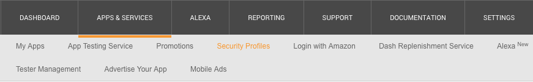
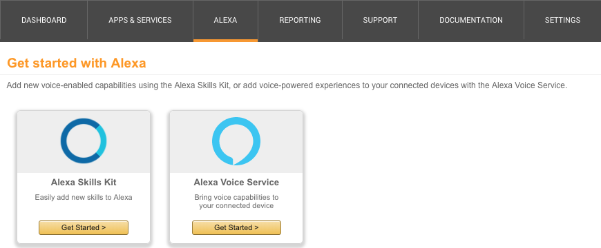

## Android - Integrate Alexa Voice Service into your Android App

This Project shows you how to integrate the Alexa Voice Service which you can find [here](https://developer.amazon.com).  
The aim of the project is that you can talk to your personalized Alexa in an Android App instead of using a physical device from Amazon like the Echo or the Echo Dot.
So let's get started.

## Prerequisites
1. [Amazon Developer Account](https://developer.amazon.com)
2. [Android Studio](https://developer.android.com/studio/index.html)

## Getting Started
The sample Application includes a login screen where you have to log in into your Amazon Account. After that you can almost use your personalized Alexa.  
If you want to Test this Application there are some steps that you need to do before you can use this project.  

### **Step 1:**
### _Create a security profile_

1. Log in to the [developer console](https://developer.amazon.com) and press on ***"Developer Console"*** on the top, afterwards move to the tab ***"Apps & Services"***
2. Now move to the Security Profiles Tag

3. Press on ***"Create a New Security Profile"*** and give your Security Profile a Name (e.g. *"Android AVS Sample App"*) and a short description. Afterwards press on Save.
4. You must enter a Privacy Notice URL. For this example we just use *"http://www.example.com/privacy.html"* Scheinbar nicht mehr benötigt
5. In addition you can upload an image but that is not really necessary for this example Auch nicht benötigt

### **Step 2:**  
### _Create an AVS product_

1. Log in to the [developer console](https://developer.amazon.com) and press on ***"Developer Console"*** on the top and move to the tab ***"Alexa"***. 
2. Press on *"Get Started"* on the Alexa Voice Service tab and click on the ["Create Product"](https://developer.amazon.com/avs/home.html#/avs/products/new) Button in the top right corner.  
3. Now you have to fill in the fields
  - As a productname you can take e.g. *"`AlexaVoiceServiceAndroid`"*
  - As a product id it is useful to use the productname with underscores like *"`alexa_voice_service_android`"*
  - Choose *"Alexa-Enabled Application"* and as Product Category you chosse *"Mobile Apps"*
  - Now give a short description about what your app is doing
  - Next choose *"Touch-initiated"* and select No for the question if you intend to distribute you product commercially and also No for the question if your product is a children's product
  - Press on Next

### **Step 3:**
### _Connect your Security Profile with your AVS Product_
1. Choose your created Security Profile
2. Now your Security Profile information should pop up. Here we won't do anything so far except for agreeing on the AVS agreement and pressing on *"Finish"*
![MacDown ScreenShot] (MacDownPictures/AcceptAgreement.png)

### **Step 4:**  
### _Download the Project_
1. First of all we need to download the [login-with-amazon-sdk.jar](https://amazonadsi-a.akamaihd.net/public/Amazon-Mobile-App-SDK-by-Platform/Amazon-Android-SDKs.zip)
2. When the download is finish unzip the file and open the folder. In it you should see a subfolder called *"LoginWithAmazon"*. Go into the folder and there you should see a file called *"login-with-amazon-sdk.jar"*. 
3. Now download the project.zip and extract it. Copy the login-with-amazon-sdk.jar into the downloaded and extracted zip. 
4. Open Android Studio and choose "*Open an existing Android Studio Project"*. Choose the downloaded project and open it. 
5. On the left side choose Project View, then make a right-click on the "*login-with-amazon-sdk.jar"*  and press on "*Add as Library"*.
6. Now open your build.gradle and there you should fill in your android keystore details. 
7. Before we can build the project we still need to add an api_key. Therefore let your project open and move back to the [developer console](https://developer.amazon.com). Go to the developer Console and choose "Alexa" and then go on Get Started and then press behind your product "manage". 

https://developer.amazon.com/docs/login-with-amazon/register-android.html
