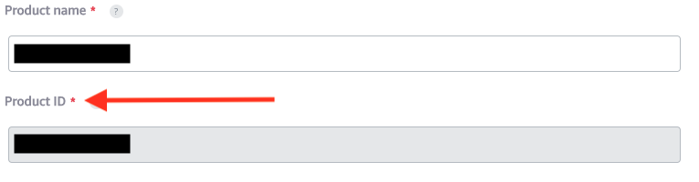
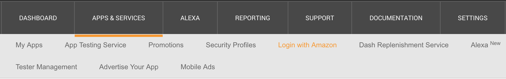
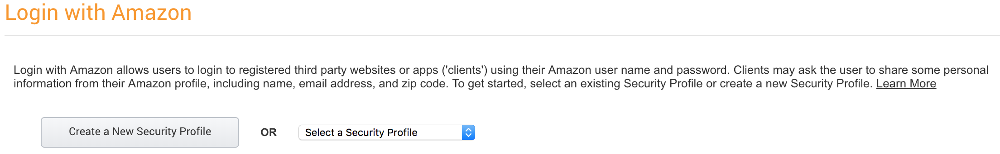

## Android - Integrate Alexa Voice Service into your Android App

This Project shows you how to integrate the Alexa Voice Service which you can find [here](https://developer.amazon.com).  
The aim of the project is that you can talk to your personalized Alexa in an Android App instead of using a physical device from Amazon like the Echo or the Echo Dot.
So let's get started.

## Prerequisites
1. [Amazon Developer Account](https://developer.amazon.com)
2. [Android Studio](https://developer.android.com/studio/index.html)

## Getting Started
The sample Application includes a login screen where you have to log in into your Amazon Account. After that you can almost use your personalized Alexa.  
If you want to Test this Application there are some steps that you need to do before you can use this project. If you just want to use the library and make it your own project go to the Use Library part of this Readme.

### **_Step 1: Download the project_** 
1. Download this project and unzip it.
2. Open Android Studio and choose **"Open an existing Android Studio Project"**. Move to the downloaded project and select it.
3. Now you have to do three things
 - First of all you need to go into the ***"assets"*** folder and open the ***"api_key.txt"*** file. Here you replace the text with your api key.
 - Next open the ***"Constants"*** class that you can find under global. Here type in your *"`product_id`"* that you can find in your developer console when you open your product. 
 - Last you have to open the build.gradle and fill in the values for your keystore. If you don't have a keystore yet, then follow these instructions to create one [Android Keystore](https://developer.android.com/studio/publish/app-signing.html).
4. Execute the project, sign in and talk to Alexa.

### **_Step 2: Create an AVS product_**
1. Go to [developer console](https://developer.amazon.com) and press on ***"Developer Console"*** on the top right corner. Afterwards log in with your Amazon Developer Account.
2. Move to the tab ***"Alexa"*** and press on ***"Get Started"*** under ***"Alexa Voice Service"***.
3. On the top right corner press on the blue button **"CREATE PRODUCT"**.
4. Now you have to fill in the fields
  - As a productname you can take e.g. *"`AlexaVoiceServiceAndroid`"*
  - As a product id it is useful to use the productname with underscores like *"`alexa_voice_service_android`"*.
  - Choose **"Alexa-Enabled Application"** and as Product Category you chosse **"Mobile Apps"**.
  - Now give a short description about what your app is doing.
  - Next choose **"Touch-initiated"** and select **"No"** for the question if you intend to distribute you product commercially and also **"No"** for the question if your product is a children's product.
  - Press on Next.
5. Now you have to create a Security Profile which is connected to your product. 
 - Choose **"CREATE A NEW PROFILE"** 
 - As a security profile name you can choose e.g. *"`Alexa Voice Service Android Security Profile`"*
 - Give a short description about what your security profile is doing.
 - Press on Next.
6. Another tab will open where you have to modify your security profile.
 - Press on the Android / Kindle tab.
 - As api key name you can choose e.g. *"`api_key`"*.
 - As package name choose *"`com.jamitlabs.bestpracticeavs`"*.
 - For the MD5 and SHA256 signature take the values that you copied out in Step 1 and fill them into the fields.
 - Finally press on **"GENERATE KEY"** and save the value of the api key.
 - Now agree to the AVS agreement and to the AVS Program Requirements and press on **"FINISH"**.
7. Your product should have been created and you should now see your product in the overview. Now press on the **"APPS & SERVICES"** tab on the top and move to **"Login with Amazon"**  
 - Now you should see the following screen. 
 - Press on **"Select a Security Profile"** and choose your Security Profile.
 - Press on Confirm. Now another window should open.
 - You must enter a Privacy Notice URL. For this example we just use *"`http://www.example.com/privacy.html`"*.
 - In addition you can upload an image but that is not really necessary for this example. 
 - Press on Save.

## Using the Library
1. If you want to design your own project there are a couple of things that you should not forget to implement.  
 - First of all you need to implement a login Screen, because you need to have a registered Alexa. To implement this, follow these following instructions [Login Screen](https://developer.amazon.com/docs/login-with-amazon/install-sdk-android.html).
 - You need to create the assets folder in the main folder with a file called "*`api_key.txt`"*. There you have to fill in your api key that you get while creating the security profile.
 - You also need a global folder with a Constants class, where you need to add this following line. "*`public static final String product_id="your_product_id";`"*.
 - In addition you need a release keystore that you need to add in the **"build.gradle"** to work with the libraries.
2. Add the library to your imports. "*`implementation 'com.jamitlabs.alexaconnect'`*"

